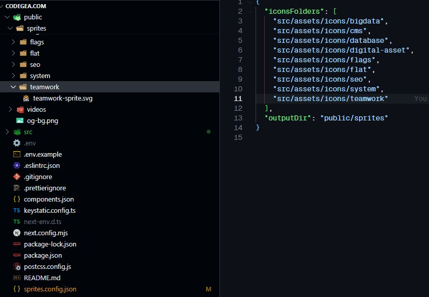

<p>
  <a aria-label="NPM version" href="https://www.npmjs.com/package/react-svg-sprites">
    
  </a>
  <a aria-label="Twitter Logo" href="https://x.com/dpintoec">
    
  </a>
</p>

---

# react-svg-sprites

react-svg-sprites is an extension to generate SVG sprites and provide an icon component in React applications.

## Installation

To install the package, run the following command:

```bash
npm install react-svg-sprites
```

## Configuration

Make sure you have a configuration file **sprites.config.json** in your root directory with the following format:

```json
{
  "iconsFolders": ["public/icons/flat", "public/icons/cms"],
  "outputDir": "public/sprites"
}
```

## Sprite generation

To generate SVG sprites, you can run the following command in your terminal:

```bash
npx react-svg-sprites
```

This will look in the folders specified in your configuration file and generate the sprites in the specified output directory.

### Result files



## Usage

To use the `SpriteIcon` component, you must first configure it with the paths to your SVG files. Here is an example of how to use it:

```jsx
import React from 'react';
import { SpriteIcon } from 'react-svg-sprites';

const App = () => {
  return (
    <div>
      <h1>SpriteIcon Example</h1>
      <SpriteIcon
        className="text-primary"
        src="/flat/timer.svg"
        width="25px"
        height="25px"
      />
    </div>
  );
};

export default App;
```

This will print something like the following:

```html
<svg class="text-primary" width="25px" height="25px">
  <use href="/sprites/flat/flat-sprite.svg#timer"></use>
</svg>
```

### Properties

- **className (string, required):** Class of the component.
- **src (string, required):** Relative path to the SVG file to be used as icon.
- **width (number, required):** Width of the icon.
- **height (number, required):** Height of the icon.
- **spritePath (string, optional):** Base path of the generated sprites. Default is /sprites.

## Contributions

If you want to contribute to this project, feel free to send a pull request or open an issue in the repository.

### If you like my work, consider buying me a coffee!

[Ko-fi](https://ko-fi.com/dpinto)
